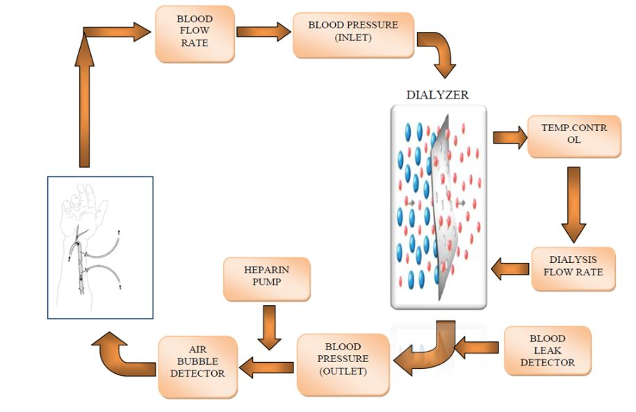

### Theory

Haemo is the Greek word for blood. Dialysis means a filtering process. Haemodialysis (HD) means the process of filtering blood. In haemodialysis, the filtering process takes place in a machine outside the body. Haemodialysis is a method for removing waste products such as creatinine and urea, as well as free water from the blood when the kidneys are in renal failure. When the kidneys do not work well, dialysis is needed to remove extra fluid and waste products from the body. Hemodialysis is a type of dialysis that uses a machine with an artificial filter to remove wastes and extra fluids from the blood. This treatment also helps control the chemical balance in the body and blood pressure. Each treatment takes about 4 hours and is done three times each week.

Kidney is one of the important organs to remove waste from the body such as potassium and urea, as well as free water from the blood. Under the healthy conditions, a kidney removes waste products from the blood and also removes excess fluid in the form of urine. Dysfunctioning kidney could loss these functions which is a dangerous situation because this may also prove fatal for a human being. Dialysis is a renal replacement for kidney dysfunction.

**Blood flow**

The blood pump takes and returns the blood from the patient via the arterial and venous needles respectively. The blood is confined to the disposable plastic tubing and doesn't come in contact with any part of the machine. The blood coming from the pump flows to the dialyzer and the blood that leaves the dialyzer returns to the patient through the venous needle.
The pump speed, and the resulting blood flow rate, is adjustable from zero to about 600 cc/min. While pump speed is controlled, blood flow rate is displayed. These two usually go hand in hand, but not always. The blood flow rate is calculated based on the pump RPM (revolution per minute), and the diameter of the tube. The calculated blood flow is displayed. The control doesn't check the real blood flow. It displays blood flow even if the pump turns without the plastic tube installed. The real blood flow may differ from the display because of:

* Internal reverse leak; the rollers never squeeze the tube completely so not all the blood is pushed forward, a little goes backward.
* High arterial and/or venous pressure reduces the ability of the pump to suck or to deliver.
* Any speed above some low value reduces gradually the blood flow. For a display of 600 cc/min the actual blood flow is 500 or less.

In addition to the inherent features of the pump, a human error that may reduce blood flow is the way the plastic tube is installed in the pump. If the plastic tube inside the pump is too tight it cannot expand to its full volume, so the suction is reduced and the pump delivers less blood flow than the display indicates.

**Blood Pressure**

The blood pressure is measured at both when it taken out from the limb and also when it is returned.

**Arterial & Venous Pressure**

These pressures are the result of the blood forced to flow through the plastic tubing, the dialyzer, and the needles.

**Arterial pressure**

When the blood flow rate increases the arterial pressure becomes more negative. If it is too negative the red blood cells may break down. This is called hemolysis. To be on the safe side never let the arterial pressure go below -220 mmHg. If it goes below that the pump speed should be reduced. If your blood count is low you may notice that the pump speed should be reduced as your blood count goes up.

**Blood flow rate**

The effect of blood flow is easy to follow - any change in pump speed is immediately reflected on the pressure displays. The higher the flow the higher the pressure.

**Dialysis Process**

Concerning the blood, dialysis performs 2 different functions that are normally done by healthy kidneys:

1. Removing excess fluid.
2. Removing waste like urea, and excess electrolytes (chemicals) like potassium, magnesium, sodium, etc.

The dialysis is performed inside the dialyzer, which is a plastic cylinder, in which the blood enters from the top, flows through thousands of extremely thin hollow fibers and leaves from the bottom. At the same time the dialysate enters from the bottom, flows around and in between the fibers, and leaves from the top. The fibers are semi permeable membranes, that is, smaller molecules in the blood stream can pass through them into the dialysate and bigger molecules as well as blood cells cannot. The dialysate is a water-based solution and its purpose is to absorb from the blood all that should be removed and nothing else.

Wastes and electrolytes move from the blood into the dialysate because their concentration in the blood is higher. This process is called diffusion.

The dialysate flow ensures that fresh dialysate is present at all times so that the dialysate doesn't become saturated and the process never ends.

Fluid is removed from the blood in the same way the kidneys do it - by blood pressure. This process is called Ultra Filtration (UF) and is similar to Reverse Osmosis (RO). With RO, the membrane pore size is very small and allows only water to pass through the membranes.
In UF, the membrane pore size is larger, allowing some bigger molecules to pass through the pores with the water.

The rate at which fluid is removed from the blood is called UFR (UF Rate). There is higher pressure in the blood passing through the dialyzer and lower pressure in the dialysate. This pressure difference is called TMP (Trans Membrane Pressure). The higher the TMP the higher the UFR.

As you can see, the dialyzer is doing the job of dialysis. The rest of the machine takes care of supplying the blood and the dialysate to the dialyzer, controls the flow and the pressures, and provides visual indication and alarm when something goes wrong.

**Dialysate**

The dialysate is a water-based solution.
With all contemporary machines, the dialysate concentrate is fed into the machine, water is fed from a water tank and a marvelous pump mixes them to the desired concentration..
      - Calcium (Ca) can be 3.5, 2.5, 2 mEq/L, depending upon the patient's calcium. (US units; Ca 3.5 mEq/L equal 1.75 mmol/L).
      - Potassium (K) can be 4, 3, 2, 1 mmol/L, or zero (free-K). (US units, used internationally).

4 is for patients that make a significant amount of urine and should not clear any potassium from their system. 3 is for patients that make some urine, 2 is for patients w/o any kidney function, 1 is used occasionally for patients with high potassium when needed. Free-K is rarely used and only in extreme cases of high potassium (like after surgery), and should be used only for an hour or so at the beginning of the treatment (to avoid removing too much potassium).

**Dialysate flow**

The dialysate pump, in addition to mixing the concentrate with water, moves the dialysate through the dialyzer. This pump has adjustable flow rate. For regular dialysis at blood flow up to 250 cc/min the dialysate flow should be 500 cc/min. For more efficient dialysis, called high flux, the blood flow is 400-500 cc/min and the dialysate flow is 800 cc/min. In addition to the controlling the flow, this multi-function pump controls the pressure of the dialysate as to achieve the desired TMP and hence the desired UFR.

**UF & UFR**

In modern dialysis machines either UF or UFR can be set. When UF is set it is called Goal; that's how many grams or cc of fluid to remove. Treatment time should also be entered so the control can calculate the UFR and the TMP. This is the way it is done in most centers.
The control is sophisticated enough to recalculate the UFR if the goal is changed during the treatment.

**Blood Leak**

Blood may leak inside the dialyzer because of ruptured fibers. This may happen even with a new dialyzer. There could be a minor leak, which is invisible, or a major leak in which blood can be seen in the dialyzer. In both cases the machine stops and sets the alarm. To resume dialysis the dialyzer should be replaced.

**Heparin Pump**

This pump delivers heparin to the blood tubing. The pump is a regular syringe that is pushed by a controlled motor. On all machines the rate can be adjusted. Usually an initial dose of heparin is given when the treatment begins, then the pump delivers heparin until one hour before the end. All patients need continuous heparin. In case of a patient after surgery or another kind of bleeding, heparin is used sparingly or not at all. To avoid clotting in the dialyzer it is rinsed with 100 cc saline every hour or so. In spite of that, the blood in the dialyzer may clot, but unless the patient has a very low blood count no treatment is required (of course the heparin dose should be increased when possible).

**Temperature**

To make it more convenient for the patient, the dialysate temperature can be set to a desired
value, so the blood returning to the patient will not be too cold. For most patients a setting of 37
C (98.6 F) is ok.

**Treatment Time**

Each treatment takes about 4 hours and is done three times each week. Moreover,depending upon the patient's clinical history the treatment may vary.

**Alarm**

There is a red alarm light. There are many reasons for the machine to alarm: the reason is either Air bubble detection or Blood leak detection.